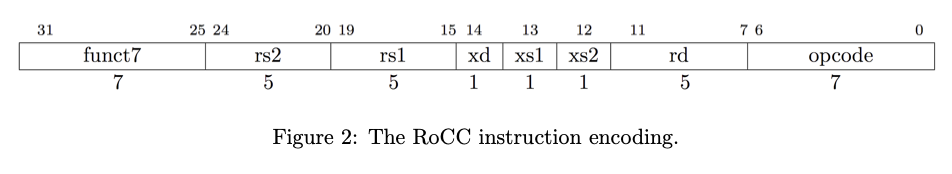

# Composer-Software

This repository contains the necessary software to interact with a Composer design over the AWS F1 FPGA Framework.

### Dependencies

[Amazon F1 SDK](https://github.com/aws/aws-fpga) - this is a dependency from the
[Composer Hardware](https://github.com/ChrisKjellqvist/Composer-Hardware) repository. Under normal circumstances, the
Composer-Hardware directory will contain the SDK, which can be used instead of installation in another directory. For
everything here to work properly, `SDK_DIR` needs to be defined, which is typically set when running `sdk_setup.sh` from
the SDK directory. Do **not** set this manually.

If you are

### Installation

```cmake -B build -S . && cd build && make install```

This requires root permissions. For user-mode builds make sure to pass the `-DCMAKE_INSTALL_PREFIX=<dir>` to cmake.
After which, make sure that this path is accessible to the linker and cmake.

# Interface Basics

The composer software library uses 3 main types to communicate with an accelerator:

- `rocc_cmd` - RoCC command to be delivered to the accelerator
- `rocc_response` - Response from the accelerator corresponding to a `rocc_cmd`
- `fpga_handle_t` - FPGA interface object

## `fpga_handle_t`

This is an interface for the FPGA with two specializations: `fpga_handle_sim_t` and `fpga_handle_real_t`.
`fpga_handle_sim_t` correponds to a VSIM simulation of the composer and `fpga_handle_real_t` corresponds to a an actual
FPGA running on an Amazon F1 instance. They both share the following interface.

### `send(const rocc_cmd &cmd)`

Send a RoCC command to the accelerator. If the build is a debug build, it will print the contents of the command.

```c++
fpga_handle_real_t my_handle;
rocc_cmd my_flush_cmd (
        0, // function
        0, // system_id
        ROCC_CMD_FLUSH // opcode
        );
my_handle.send(my_flush_cmd);
```

### `rocc_response get_response()`

Wait for a response from the accelerator. Returns a `rocc_response` type.

```c++
fpga_handle_real_t my_handle;
rocc_cmd my_cmd (...);
my_handle.send(my_cmd);

auto resp = my_handle.get_response();
int retval = resp.data;
int dest_reg = resp.rd;
```

### `flush()`

Wait for all in-flight instructions to be flushed from the accelerator.

```c++
fpga_handle_real_t my_handle;
my_handle.flush()
```

## RoCC Composer Instructions: `rocc_cmd`

The RoCC Instruction format is shown below. 
[Credit](https://inst.eecs.berkeley.edu/~cs250/fa13/handouts/lab3-sumaccel.pdf) to Ben Keller for this figure.



Commands for the composer use this format for the instruction base and sends an additional 2 64-bit payloads.
The 7 function bits are slightly mis-used in Composer. The top 4 bits are the system_id corresponding to which type
of composer core is being used. The actual function that you want the composer core to perform is the bottom 3 bits.

```c++
// Composer Instruction Constructor
rocc_cmd::rocc_cmd(uint16_t function,  // 4 bits
                   uint16_t system_id, // 3 bits
                   uint8_t opcode,     // ROCC_CMD_ACCEL or ROCC_CMD_FLUSH
                   uint8_t rs1_num,    
                   uint8_t rs2_num,
                   uint8_t xd,
                   RD rd,
                   uint8_t xs1,
                   uint8_t xs2,
                   uint64_t rs1,
                   uint64_t rs2);
```

Notice that the destination register is type `RD`. To emphasize the use of special-purpose Composer registers, we
use `enum RD`. There are 32 registers, but register 16 through 22 (inclusive) are special purpose registers for 
accumulating AXI-4 memory bus statistics. If a non-special register is provided for `rd`, then the return value as
part of `rocc_response` will be the value returned from the Composer core during execution. If `rd` is a special
register, then the value stored within the special composer register will be returned. 

```c++
enum RD {
  /**
   * General purpose registers
   */
  R0 = 0,
  R1 = 1,
  R2 = 2,
  R3 = 3,
  R4 = 4,
  R5 = 5,
  R6 = 6,
  R7 = 7,
  R8 = 8,
  R9 = 9,
  R10 = 10,
  R11 = 11,
  R12 = 12,
  R13 = 13,
  R14 = 14,
  R15 = 15,
  /**
   * Special Registers
   **/
  AddressReadCnt = 16,
  AddressWriteCnt = 17,
  ReadCnt = 18,
  WriteCnt = 19,
  WriteResponseCnt = 20,
  ReadWait = 21,
  WriteWait = 22,
  /**
   * More general purpose registers
   */
  R23,
  R24,
  R25,
  R26,
  R27,
  R28,
  R29,
  R30,
  R31
};
```

The [AXI Spec](https://developer.arm.com/documentation/102202/0300/Channel-signals) has 5 ports for memory
- AW - Write address port
- W - Write data port
- B - Write response port 
- AR - Read address port 
- R - Read response port

Composer counts the number of responses for each one of these ports for debugging purposes (presumably).
Composer also collects the number of cycles spent waiting for read responses(21) and for write responses(22)

### decode()

Output the contents of a RoCC command.

## RoCC Response

```c++
struct rocc_response {
  uint32_t data;
  uint8_t core_id;
  uint8_t system_id;
  uint8_t rd;
};
```

Whenever a instruction successfully completes, the accelerator responds with a `rocc_response`. It contains a 32-bit
return value, the id of the composer system that performed the instruction, the id of the core within the system that
completed it, and the destination register that came from the instruction.